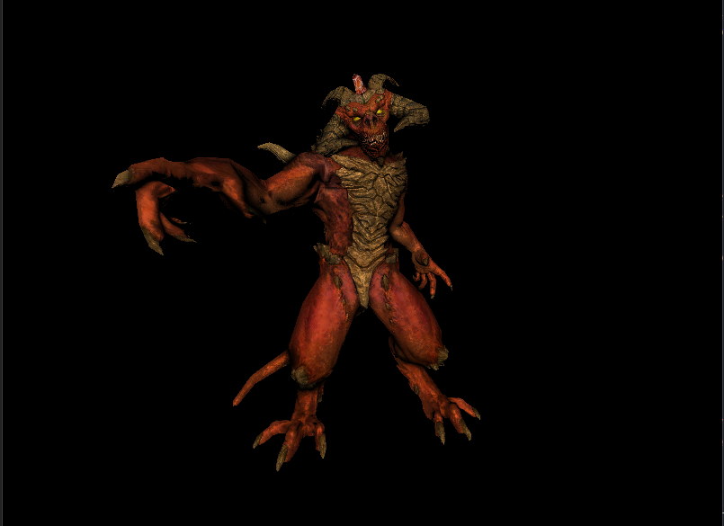
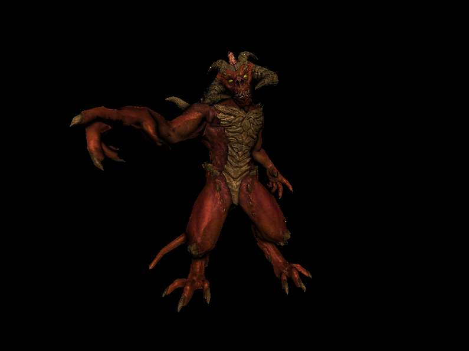
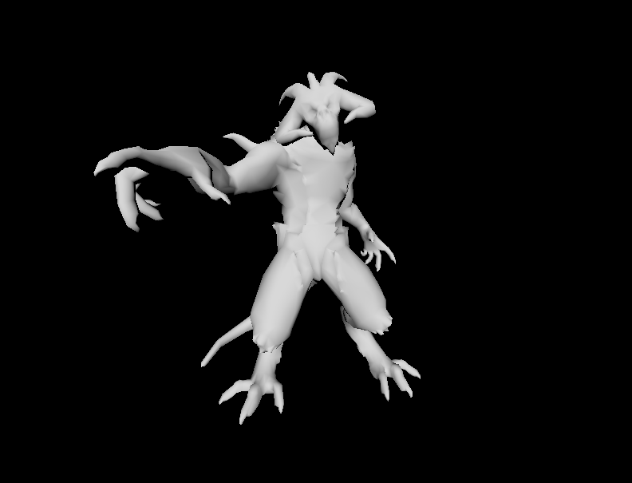
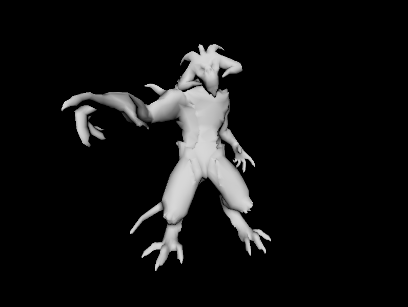

#  SoftwareRenderer
* This project is still a work in progress until I am satisfied with the work that I put in :)  

* Current render  
  assets from [ssloy/tinyrenderer](https://github.com/ssloy/tinyrenderer) by artist Samuel (arshlevon) Sharit, and it's used here only for educational and demonstration purpose.      
  * Phong shader  
    

  * PBR shader  
    

## Progress
* Finished implementing Cook-Torrance specular BRDF and tested using debug_scene. 

* Current implementation of SSAO computes occlusion in one direction only using difference in depth. Thus result is not as apparent as I expected in the final render. Here is a comparison. Flat shader is used to allow more obvious visual difference. I plan to implement another ssao algorithm that takes normal at each fragment into consideration to see if there is any apparent visual improvements.   
    
  

### TODO
* Improve and debug ssao.
* Add few other scenes, and tweak the posing of models used in the scene
* Maybe camera control?? or maybe add a simple gui widget that allows me to easily adjust camera related parameters at run time. 
* SIMD for performance improvements, currently in debug build, drawing one frame of default_scene can goes up to 160ms with SSAO turned on. 
* Multi-threading

## Overview
  * A software renderer wrote from scratch in C++, right now lack of parallelism.
  * This personal project is inspired by following two amazing works [ssloy/tinyrenderer](https://github.com/ssloy/tinyrenderer/wiki) and [Angelo1211/softwareRenderer](https://github.com/Angelo1211/SoftwareRenderer). It serves the purpose for me to get into nitty-gritty details of computer graphics out of my strong interest in the discipline.
### timeline
  * I started writing this project outside of work during my summer internship as a game programmer in July 2019 for fun, and I have been working on it on and off after I returned to school to finish my master's degree in computer science.  
### implementation
  Following is the list of real-time rendering techniques that I researched and implemented. 
  * Triangle rasterization
  * Architected to immitate modern graphics pipeline 
  * Perspective correct interpolation
  * Texture mapping
  * Tangent space normal mapping
  * Phong shading
  * Physically based shading
  * SSAO post-processing
### libraries 
  * Windowing backend using glew and glfw.
  * Scene is defined in customzied JSON format. I use a JSON parser library [nlohmann/json](https://github.com/nlohmann/json) for scene file parsing.
  * Texture resources loading is handled using handy [stbi_image.h](https://github.com/nothings/stb/blob/master/stb_image.h).

##  Study Notes

######  This documentation is meant as study notes that compiled from my experiences of implementing this project, so that I can keep things more organized and make it a more meaningful learning experience
###### Triangle Rasterization

* Given three vertices of a triangle, define a bounding box to minimize number of pixels that we need to scan through

* Then traverse every pixels within the bounding box

  * ```pseudocode
    For each pixel within BoundingBox：
    	Compute pixel's barycentric coordinates
    	Determine if the pixel overlaps the triangle:
    		pixel shading
    ```
  * For computing the barycentric coordinates, I adopted Cramer's rule to solve the linear system

###### Wavefront .obj file
* Models used for all the scenes are mostly in .obj format because of it's simplicity. I wrote a simple .obj loader that is far from optimal, but it serves the purpose. 

###### Matrix Transformation pipeline

* Model -> World: Model matrix is pretty intuitive. It can be further decomposed in to 
  * Translation * Rotation *  Scale (order matters!!!)

* World -> Camera:
  * View transformation: by default, the camera is looking down -z direction, in this case, after the view transformation, all the vertices 

* Camera -> Clip:
    * I misunderstood the camera's forward vector. I used to thought forward should pointing to camera's target, while the opposite is true. Though camera's looking down -z direction, its initial three axis should still be aligned with directions of world space axises. In this case, the forward vector should be derived using ```camera.position - target.position```. 

###### Normal Mapping