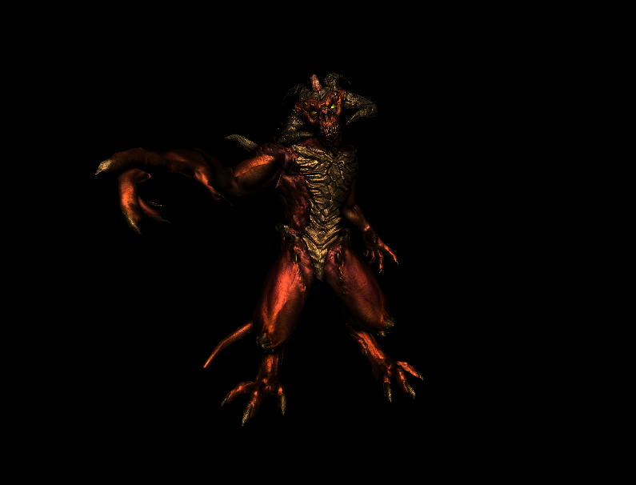
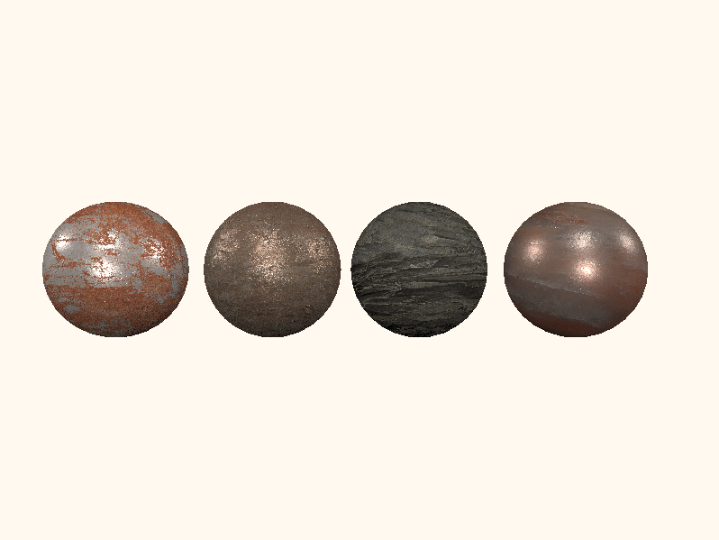

#  SoftwareRenderer
* This project is on hietus for now as I'm working on another toy OpenGL renderer outside of work.

* Current render  
  assets from [ssloy/tinyrenderer](https://github.com/ssloy/tinyrenderer) by artist Samuel (arshlevon) Sharit, and it's used here only for educational and demonstration purpose.      
  * Phong shader  
    

  * PBR shader  
  with uniform metal = 1.f, roughness = .5f  
    
      

  pbr assets found from:    
  [Quixel/tmenafmn](https://quixel.com/assets/tmenafmn)    
  [Quixel/tihgbicfw](https://quixel.com/assets/tihgbicfw)   
  [Quixel/smokagcp](https://quixel.com/assets/smokagcp)  
  [learnOpenGL](https://learnopengl.com/PBR/Lighting)

## Overview
  * A software renderer wrote from scratch in C++, right now lack of parallelism.
  * This personal project is inspired by following two amazing works [ssloy/tinyrenderer](https://github.com/ssloy/tinyrenderer/wiki) and [Angelo1211/softwareRenderer](https://github.com/Angelo1211/SoftwareRenderer). It serves the purpose for me to get into nitty-gritty details of computer graphics out of my strong interest in the discipline.

  Following is a list of features that I studied and implemented. 
  * Triangle rasterization
  * Structured to immitate modern graphics pipeline 
  * Perspective correct interpolation
  * Texture mapping
  * Tangent space normal mapping
  * Phong shading
  * Physically based shading
  * SSAO post-processing
